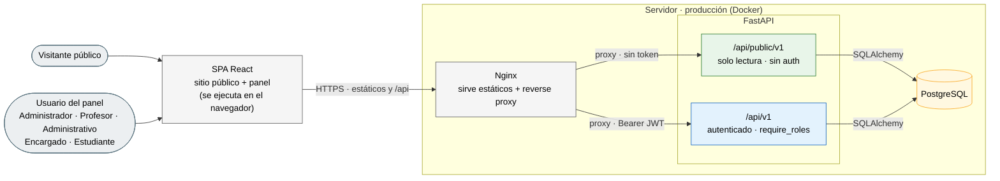
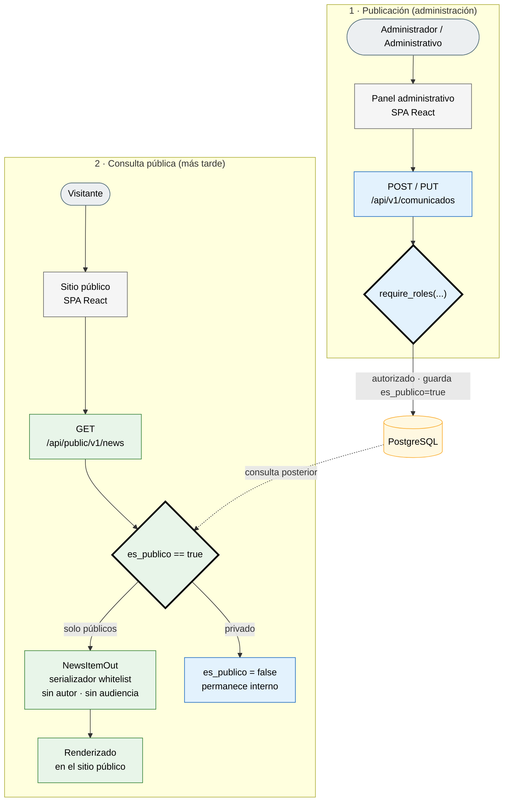
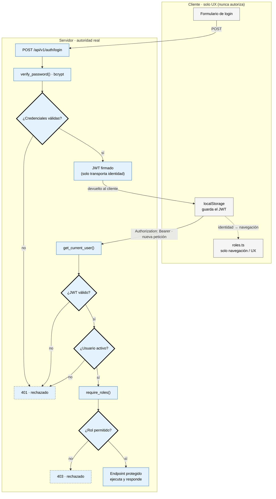
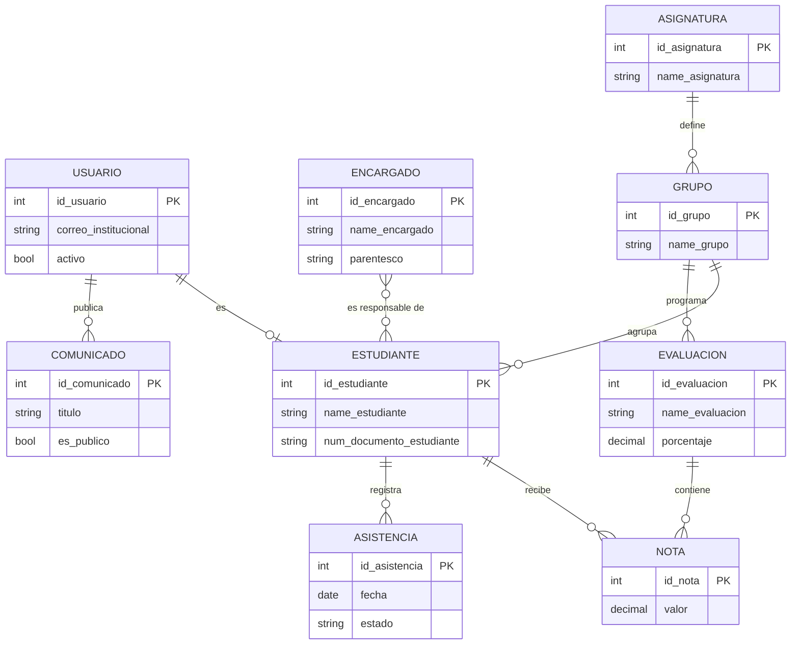
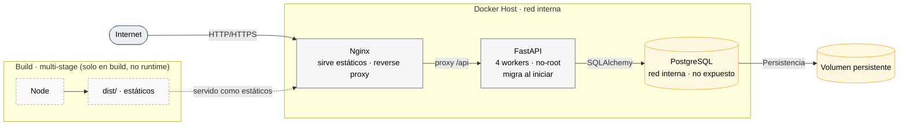

# Sistema Institucional — CTP San Pedro de Barva

Sistema de gestión escolar con **tres superficies claramente separadas**: un **sitio público** institucional, un **panel administrativo** con control de acceso por rol, y una **API pública de solo lectura** que alimenta el sitio a partir de contenido marcado explícitamente como publicable.

No es un CRUD: la decisión central del diseño es una **frontera público/privado aplicada por construcción** — el contenido nunca aparece en público por accidente y la API pública no puede exponer datos internos.

   

> **Estado:** v1.0.0 — funcionalmente completo y auditado. Lo pendiente para un despliegue real es **externo** (contenido e imágenes del colegio, dominio, TLS); ver [Alcance y limitaciones](#alcance-y-limitaciones).

---

## Qué lo hace distinto

- **Frontera público/privado por diseño** — routers y serializadores separados; `es_publico` es *opt-in* con `server_default false` a nivel de base de datos.
- **API pública con contrato escrito** ([`docs/API_PUBLICA.md`](docs/API_PUBLICA.md)) — solo lectura, sin autenticación, campos en *whitelist*.
- **Infraestructura de producción real y verificada** — build multi-stage → Nginx (reverse proxy + estáticos + gzip + cache + cabeceras de seguridad), backend con workers y usuario no-root, PostgreSQL en red interna.
- **Evolución de esquema aditiva** — migraciones Alembic, nunca destructivas.

---

## Arquitectura (C4 · contenedores)

Topología de producción. En desarrollo no hay Nginx (Vite sirve la SPA y el backend se expone directo).



## Flujo de publicación de contenido

Cómo un contenido pasa del panel al sitio público **de forma segura** — protegido por dos controles independientes.



## Autenticación y autorización (RBAC)

La autoridad vive **en el servidor**. El frontend solo organiza la navegación; nunca autoriza.



## Stack

| Capa | Tecnologías |
|---|---|
| **Backend** | FastAPI · SQLAlchemy 2 · Alembic · Pydantic v2 · PostgreSQL 16 · PyJWT (HS256) · bcrypt |
| **Frontend** | React 19 · TypeScript 5 · Vite 7 · React Router 7 · Tailwind CSS 4 · Radix UI · Iconify |
| **Infraestructura** | Docker · Docker Compose (dev y prod) · Nginx (reverse proxy en prod) |

## Características

**Sitio público** — Hero, Historia e Identidad, Especialidades, Vida Estudiantil, Noticias, Calendario, Admisión, Contacto; SEO (meta/OG/Twitter/JSON-LD), responsive, estados vacíos.

**Panel administrativo** (por rol) — Estudiantes, Profesores, Administrativos, Encargados, Materias, Grupos, Subgrupos, Asistencia, Calificaciones, Reportes, Matrícula, Comunicados, Calendario, Especialidades. Dashboard con estadísticas en vivo.

**API pública** — `GET /api/public/v1/{news,calendar,specialties}`: solo lectura, paginada, filtrable, con envoltorio de error uniforme. Contrato en [`docs/API_PUBLICA.md`](docs/API_PUBLICA.md).

## Seguridad

- **JWT** (HS256) validado en el servidor; `SECRET_KEY` **obligatoria y validada** (la app no arranca con una clave insegura).
- **RBAC** con `require_roles` como **única autoridad**; el frontend (`roles.ts`) solo controla navegación.
- **IDOR** cerrado en Reportes (`_ids_permitidos` → 403).
- **API pública** sin autenticación, solo lectura, con serializadores en *whitelist* (nunca expone autor/audiencia).
- **CORS por entorno** (sin `localhost` incrustado), **rate limiting** por IP, y en producción **Nginx con CSP + cabeceras de seguridad**.

## Modelo de datos (simplificado)

Núcleo académico + identidad + publicación desacoplada. Modelo completo (19 tablas) en [`docs/`](docs/).



> El modelo actual está pensado para **un colegio y un ciclo lectivo**; no incluye eje temporal (año lectivo) como entidad. Ver observaciones de dominio en [`docs/`](docs/).

## Infraestructura de producción

Un único punto de entrada; servicios internos aislados; prácticas reales (multi-stage, no-root, workers, migraciones al arranque, persistencia por volumen).



## Cómo ejecutarlo (desarrollo)

**Backend + base de datos** (Docker):

```bash
cp backend/.env.example backend/.env   # completar SECRET_KEY (openssl rand -hex 32) y credenciales
docker compose up -d
docker compose exec backend alembic upgrade head
docker compose exec backend python -m app.db.seed
```

**Frontend** (Vite):

```bash
cd tailwind-admin-reactjs-free/package
npm install
npm run dev
```

El sitio público queda en `http://localhost:5173/inicio` y el panel en `http://localhost:5173` (login con el administrador del seed).

## Producción

Compose de producción independiente (Nginx + backend con workers + PostgreSQL cerrado):

```bash
docker compose -f docker-compose.prod.yml up -d --build
```

Guía completa (variables, CORS, dominio, TLS, DNS, favicon/OG) en **[`docs/DEPLOYMENT.md`](docs/DEPLOYMENT.md)**.

## Estructura del repositorio

```
backend/                     API FastAPI (models, schemas, api/v1, api/public, core, db)
tailwind-admin-reactjs-free/package/   Frontend React (src: views, components, layouts, lib, hooks, content)
docs/                        Arquitectura, API pública, despliegue, dominio, contenido
docker-compose.yml           Desarrollo (db + backend)
docker-compose.prod.yml      Producción (db + backend + web/nginx)
```

## Documentación

| Documento | Contenido |
|---|---|
| [`docs/API_PUBLICA.md`](docs/API_PUBLICA.md) | Contrato de la API pública |
| [`docs/ARQUITECTURA-FRONTEND.md`](docs/ARQUITECTURA-FRONTEND.md) | Arquitectura del frontend |
| [`docs/ARQUITECTURA-SITIO-PUBLICO.md`](docs/ARQUITECTURA-SITIO-PUBLICO.md) | Arquitectura del sitio público |
| [`docs/CATALOGO-COMPONENTES.md`](docs/CATALOGO-COMPONENTES.md) | Capa de componentes institucionales |
| [`docs/CONTENT_GUIDE.md`](docs/CONTENT_GUIDE.md) | Guía de contenido institucional |
| [`docs/DEPLOYMENT.md`](docs/DEPLOYMENT.md) | Despliegue paso a paso |
| [`docs/DIAGRAMAS.md`](docs/DIAGRAMAS.md) | Diagramas técnicos (ERD completo, agregados, dev vs prod) |

## Alcance y limitaciones

**Alcance:** un colegio, un ciclo lectivo, gestión académica básica + comunicación pública. Construido sobre una base de plantilla de UI, con el código de aplicación (dominios, seguridad, sitio público, API) desarrollado a medida.

**Pendiente — solo depende de recursos externos:**
- Contenido e **imágenes reales** del colegio (hoy las secciones dinámicas muestran estados vacíos correctos).
- **Dominio oficial** (canonical/OG/sitemap — documentado en `DEPLOYMENT.md`).
- **TLS/despliegue** en infraestructura real.

**Deuda técnica conocida (no bloquea v1.0):** sin pruebas automatizadas ni CI; listas administrativas sin paginación server-side (adecuado a la escala de un colegio); modelo sin eje temporal (año lectivo) para evolución multi-ciclo.

## Licencia

MIT — ver [`LICENSE.md`](LICENSE.md).
