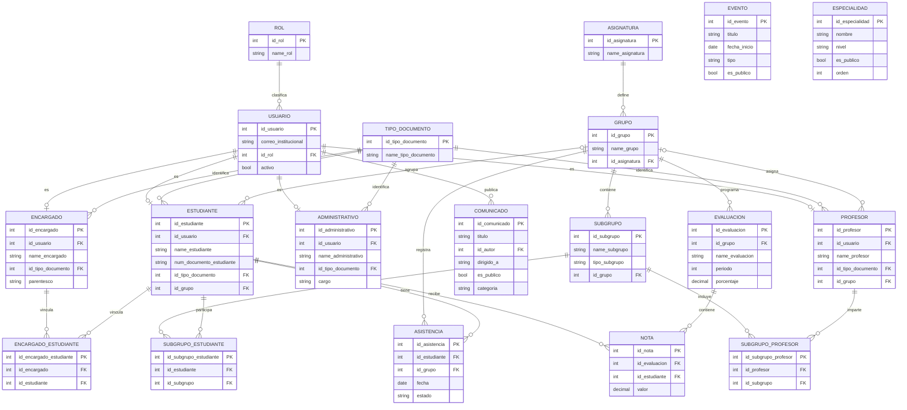
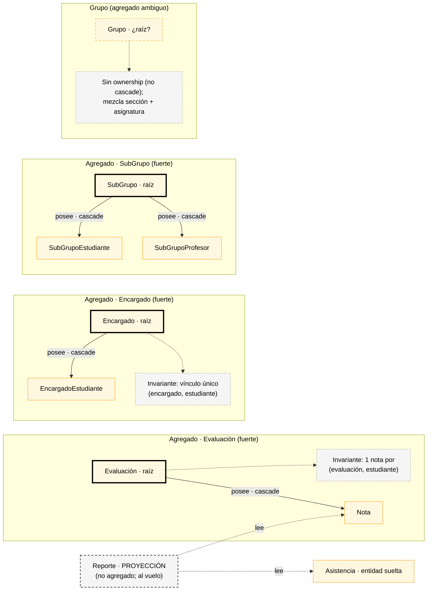
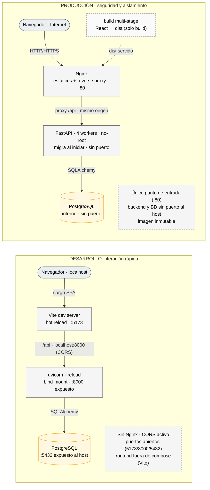

# Diagramas técnicos

Documentación visual de referencia para quien va a modificar el sistema. Los diagramas del README cubren el sistema completo, el flujo de publicación, la autenticación, la infraestructura y el ERD simplificado. Aquí van los de mayor profundidad.

> Nota: `erDiagram` de Mermaid no soporta color por zonas; la separación de contextos se transmite por orden y comentarios.

---

## 1. ERD completo (19 tablas)

Esquema conceptual completo del modelo persistente. Las tablas puente aparecen explícitas; la cardinalidad refleja la nulabilidad real de las FKs.

### Observaciones del modelo (derivadas del código)

- **Sin eje temporal** *(hecho)*: no existe `AñoLectivo`/`Periodo` como entidad; `evaluacion.periodo` es un `int` suelto.
- **Matrícula como atributo** *(hecho)*: la pertenencia de un estudiante a un grupo es `estudiante.id_grupo` (mutable), no una entidad con historia.
- **`EVENTO` y `ESPECIALIDAD` standalone** *(hecho)*: sin FKs; la especialidad del estudiante no está modelada (es contenido publicable).
- **`GRUPO` mezcla sección y asignatura** *(hecho: `id_asignatura` NOT NULL + `estudiante.id_grupo` único)*.

---

## 2. Agregados del dominio (fronteras de consistencia)

Dónde viven las invariantes reales (criterio: `cascade` + `UniqueConstraint` en el código).

Las invariantes de **negocio** (rango de nota, estado de asistencia, audiencia por rol) viven en los *handlers*, no en el modelo (dominio anémico).

---

## 3. Desarrollo vs Producción

Qué cambia entre ambos entornos.

